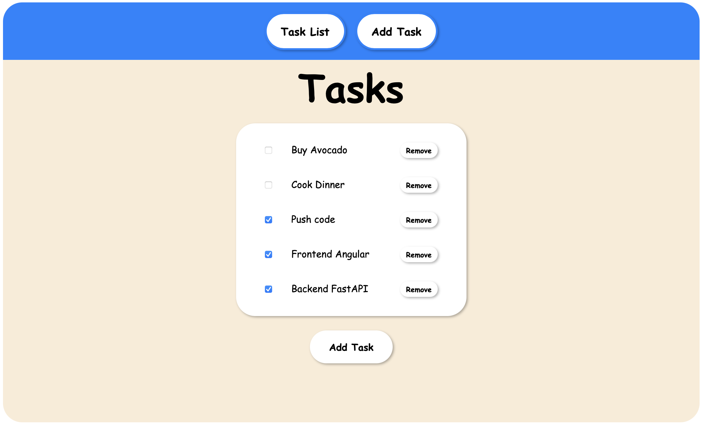

# 📝 Task Tracker

A lightweight full-stack Task Tracker app built with **Angular 20** (frontend) and **FastAPI** (backend). Designed as a practical portfolio project to demonstrate clean architecture, RESTful API integration, and modern web development practices.

---

## 🔧 Tech Stack

### Frontend

- Angular 20
- TypeScript
- RxJS
- Angular Router
- Angular Forms

### Backend

- FastAPI
- Pydantic
- Uvicorn (for dev server)
- CORS middleware
- UUID-based task management

---

## 📁 Project Structure

```
task-tracker/
│
├── backend/           # FastAPI backend
│   ├── main.py        # API endpoints
│   ├── schemas.py     # Pydantic data models
│   └── requirements.txt
│
├── frontend/          # Angular frontend
│   ├── src/
│   │   ├── app/
│   │   │   ├── components/
│   │   │   │   ├── task-add/    # Add new task
│   │   │   │   └── task-list/   # Display tasks
│   │   │   ├── services/
│   │   │   │   └── task.service.ts  # API interaction
│   │   │   ├── models/
│   │   │   │   └── task.ts          # Task interface
│   │   │   └── app.component.ts
│   ├── angular.json
│   └── package.json
```

---

## Screenshots



## 🚀 Getting Started

### Prerequisites

- Node.js (v18+)
- Python (v3.10+)
- Angular CLI (`npm install -g @angular/cli`)
- Virtualenv (recommended)

---

### 🔹 Backend Setup (FastAPI)

```bash
cd backend
python -m venv venv
source venv/bin/activate  # on Windows use venv\Scripts\activate
pip install -r requirements.txt
uvicorn main:app --reload
```

- API available at: `http://127.0.0.1:8000`
- Interactive docs: `http://127.0.0.1:8000/docs`

---

### 🔹 Frontend Setup (Angular)

```bash
cd frontend
npm install
ng serve
```

- Frontend running at: `http://localhost:4200`

---

## 📡 API Overview

| Method | Endpoint      | Description         |
| ------ | ------------- | ------------------- |
| GET    | `/tasks`      | Fetch all tasks     |
| POST   | `/tasks`      | Create a new task   |
| DELETE | `/tasks/{id}` | Delete a task by ID |

All tasks are stored in memory during runtime and identified using UUIDs.

---

## 📸 UI Features

- Add new tasks via form input
- View task list in real-time
- Delete tasks individually
- Smooth Angular animations & form validation

---

## 💡 Why This Project?

This project was built to:

- Demonstrate integration of Angular with a Python backend
- Practice clean, minimal full-stack app structure
